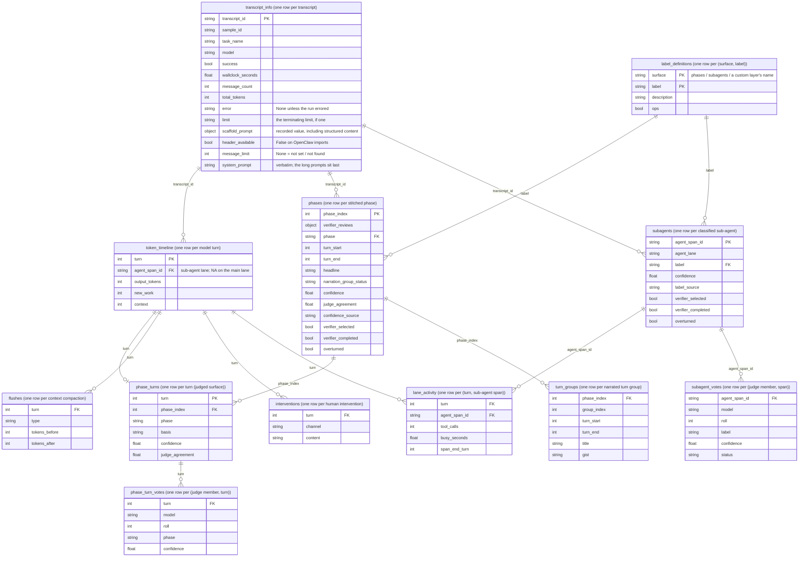

<p align="center">
  <picture>
    <source media="(prefers-color-scheme: dark)" srcset="docs/images/transect-logo-dark.svg">
    
  </picture>
</p>

# Transect

Transcript analysis for long-horizon agent evaluations, built on
[Inspect Scout](https://meridianlabs-ai.github.io/inspect_scout/).

As agent runs stretch to hundreds of pages, the range of what a
reviewer can reliably infer about the model's behaviour narrows.
Pointing an LLM judge at the transcript only moves the problem:
judged labels cannot be taken at face value either. Transect is
built around that fact. Every classification it produces carries
provenance and reliability information so reviewers can inspect how labels
were produced and where judges disagree.

```python
from transect import transect

results = transect(
    "logs/",  # Inspect .eval log(s), or OpenClaw .jsonl
    "spec.yaml",  # your phase + sub-agent vocabulary
    judge_models="anthropic/claude-sonnet-4-6",
)
# Transect report  -> scans/report.html
# Scout viewer  -> http://127.0.0.1:PORT  (deep links into the transcript)
```

Transect places a run on one navigable turn-based timeline:
structural scanners extract recorded events (token use, context
compactions, human interventions, sub-agent activity) at no model
cost, judged scanners classify behaviour against your own
vocabulary, and an HTML report presents both. The
same surfaces land as pandas dataframes, and everything
extends: custom scanners, custom report layers, or a fully custom
UI over the frames.

## Contents

- [Prerequisites](#prerequisites)
- [Installation](#installation)
- [Getting started](#getting-started)
- [Reading the report](#reading-the-report)
- [Working with the dataframes](#working-with-the-dataframes)
- [Custom layers](#custom-layers)
- [Cost](#cost)
- [Development](#development)

## Prerequisites

- Python 3.12+
- The SDK and an API key for each judge-model provider you use:

  ```bash
  pip install anthropic
  export ANTHROPIC_API_KEY=your-anthropic-api-key

  pip install openai
  export OPENAI_API_KEY=your-openai-api-key
  ```

  Any [Inspect AI model
  provider](https://inspect.aisi.org.uk/providers.html) works; a
  judged run without the provider's package installed fails.

- Transcripts: Inspect `.eval` log files, or OpenClaw `.jsonl`
  telemetry exports.

## Installation

Install straight from GitHub:

```bash
uv pip install git+https://github.com/AI-Safety-Institute/transect.git
# or: pip install git+https://github.com/AI-Safety-Institute/transect.git
```

Or clone for a local install (the runnable examples live in the
repository, not the package):

```bash
git clone https://github.com/AI-Safety-Institute/transect
cd transect
uv sync
# or: pip install -e .
```

If you work with Claude Code, the package ships four skills - a
guide to running the default pipeline and reading the report
(`using-transect`), the reliability iteration loop (`transect-diagnostics`),
the custom-layer authoring recipe (`add-a-layer`), and the
custom-presentation recipe (`custom-ui`). Install them into your
project once (re-run after upgrading the package):

```bash
python -m transect.skills install   # use the interpreter where you installed Transect
# After uv sync in a clone: uv run python -m transect.skills install
```

Installing in the package's editable checkout leaves the source skills unchanged.
Elsewhere, each skill is staged before replacement; a failed replacement restores
its previous copy. If restoration also fails, the error names a retained backup.
Other skills are untouched. This is per-skill recovery, not an all-skills transaction
or protection against concurrent installers or process termination.

## Getting started

The repository ships a runnable worked example in `examples/`:

Start with a built-in structural run that makes no model calls:

```bash
uv run python - <<'PY'
from transect import transect

results = transect(
    logs="examples/logs",
    spec="examples/spec.yaml",
    judge_models=None,
    scans_dir="scans/demo-structural",
    report_path="scans/demo-structural/report.html",
    viewer=False,
    open_report=False,
)
print(results.scan_location)  # save this for exact reload
print(results.frames()["token_timeline"].head())
PY
```

Open `scans/demo-structural/report.html`; structural data is populated
and judged sections are empty. Charts require their CDN assets. The following
judged examples require provider credentials and incur model charges:

```bash
uv run python examples/transect_kroll.py    # one judge, 3 rolls + verifier
uv run python examples/transect_cohort.py   # three-model judge cohort
```

`examples/README.md` walks through both.

### Concepts

- **Spec**: one YAML/JSON file describing an evaluation family,
  reusable across its runs: phase vocabulary, sub-agent labels,
  free task context for phase judges.
- **Scanners**: per-transcript extractors, run by Scout. Structural
  scanners are free and always on; judged scanners run when
  `judge_models` is set and the Spec declares their vocabulary.
- **Judge regimes**: one model solo, one model rolled `k_rolls`
  times, or a multi-model cohort - votes decided by majority - plus
  an optional verifier that re-checks doubtful judgements.
- **Frames**: the results as pandas dataframes.
- **Report + viewer**: an HTML report with embedded report data; interactive
  charts load JavaScript assets from a CDN. Full-source links require a running
  local Scout viewer and accessible source transcripts. `viewer=False` disables
  that viewer; it does not make the report's charts fully offline.

### Triaging your own transcripts

Two built-in judged scanners need your input, declared in the
spec. `decision_phases` segments the run into contiguous phases:
it needs the phase vocabulary you expect the run to move through,
each phase described in your own words. `subagent_classification`
labels every spawned sub-agent from its delegation instructions:
it needs the sub-agent roles you expect. Free task context
gives the phase judge background on the eval itself. The better
your descriptions, the better the labelling. A minimal spec:

```yaml
context: >
  An open-ended AI R&D task: the agent is given a research brief
  and has to implement the described method, run experiments with
  it, and write up its findings. It can delegate subtasks to
  sub-agents.

phases:
  - label: planning
    description: Understanding the brief and choosing an approach.
  - label: implementation
    description: Writing and debugging the method and experiment code.
  - label: experimentation
    description: Running experiments and analysing their results.
  - label: writeup
    description: Writing the findings up into the report.

subagent_labels:
  - label: literature_survey
    description: Surveys prior work relevant to the brief.
  - label: experiment_run
    description: Runs a training or evaluation experiment.
  - label: result_review
    description: Checks results and drafts before they are used.
```

`none_of_the_above` and an operational bucket are always
available to the judges.

> [!TIP]
> The shipped skills help here (see [Installation](#installation)):
> `using-transect` drafts a first spec from your description of the
> eval. Expect to iterate, a rubric is rarely right first time:
> read the report's reliability audit, refine your labels and
> descriptions, and re-run; `transect-diagnostics` walks that loop.

With the spec written, one call runs the whole pipeline:

```python
from transect import transect

results = transect(
    "logs/my_run.eval",
    "spec.yaml",
    sample="my-sample",  # which sample from the log to scan
    epochs=1,  # which epoch(s); "all" = report per epoch
    judge_models="anthropic/claude-sonnet-4-6",
    k_rolls=3,
    verify=True,
    scans_dir="scans/my_run",  # where the scan results land
)
```

This extracts the structural surfaces, has the judge label every
turn and sub-agent against your spec (three rolls each, majority
vote, with a verifier re-checking doubtful judgements), writes the
results to `scans_dir`, renders the HTML report, and starts the
viewer.

`load(scans_dir)` re-reads a stored scan without rescanning (and without API
calls); `render(results)` re-renders the report. Use `results.scan_location`
to reload that exact scan rather than whichever scan is latest in its parent.

Inspect `results.scan_status` before interpreting partial results. It retains
the stored execution completion, requested scanner roster, concise errors and
completed-vs-total transcript counts. `outer_complete` means Scout finished
execution; `has_failures` also checks recorded errors, missing scans and store
integrity. Neither establishes that labels are usable or correct: judgement
quality (abstentions, filled labels, member and verifier degradation) is the
reliability audit's territory. Partial results are returned when their required
structural tables and mounted custom-frame contracts can be loaded; violations
still raise an error. `load()` preserves the same status without judging.

## Reading the report


Top to bottom, everything on a shared turn axis (a red flag at the very
top marks scan execution failures; the run-wide "Scan execution &
coverage" section it links to sits at the bottom):

- **Eval setup**: model, scaffold, verbatim prompts, limits, run summary.
- **Phase timeline**: the phase band plus the per-turn judge-agreement strip.
- **Human interventions**: mid-run operator messages and console inputs.
- **Token telemetry**: per-turn token measures and context size, compactions marked.
- **Sub-agent activity**: one swimlane per spawned sub-agent, with its classified role.
- **Token spend**: token quantities by phase, sub-agent, or custom tag family;
  these charts do not estimate monetary cost.
- **Phase cards**: one expandable card per phase: label, narration, excerpts, reliability.
  New scans preserve complete narration headlines and summaries; blank headlines
  use a neutral template. Neutral grouping carries a visible reason
  when ranges are invalid, groups are empty, or no usable narrative was returned.
  Invalid narrative group partitions use a neutral whole-phase group; descriptions
  are never stretched to different turn ranges. Older stored groups remain unchanged.

- **Custom layers**: user layers' own sections; `section_order` rearranges the report.
- **Reliability & provenance audit**: per judged surface, how every label was produced.

Token views use Inspect's normalized usage: `input_tokens` excludes cache reads
and writes; `output_tokens` includes reasoning. The raw counters are preserved.
`turn_total` sums input, cache reads/writes and output once. `new_work` estimates
new content using per-lane context growth; it is not a measure of effort. The
`billable` column sums uncached input, output and cache writes, excluding cache
reads; its chart is labelled accordingly. No token view applies monetary prices.
Missing optional breakdowns count as zero in derived views, and differing raw
`total_tokens` are retained rather than silently reconciled. Custom importers must
normalize usage to the supported Inspect contract before analysis.

### Building your own UI

The shipped report is the reference rendering: build your own
presentation over the frames. The reliability and provenance
discipline travels with the data, not with our HTML.

> [!TIP]
> The recipe and checklist are the `custom-ui` skill.

## Working with the dataframes

For custom analysis beyond the generated report, everything the
scanners extracted is exposed as pandas dataframes on the results
object, ready for a notebook or your own Python:

```python
frames = results.frames()  # dict of name -> DataFrame
frames["transcript_info"]  # one row per transcript: task, model, outcome, setup
frames["token_timeline"]  # per-turn token usage + context size
frames["flushes"]  # context compactions, tokens before/after
frames["interventions"]  # mid-run human interventions
frames["lane_activity"]  # per-turn sub-agent tool activity
frames["phases"]  # stitched phases + reliability
frames["phase_turns"]  # per-turn phase attribution
frames["turn_groups"]  # narrated turn groups within each phase
frames["phase_turn_votes"]  # per-judge per-turn votes
frames["subagents"]  # one row per sub-agent span, classification when judged
frames["subagent_votes"]  # per-judge votes behind each label
frames["label_definitions"]  # the label rubric the judges classified against
```

Every frame carries the identity prefix (`sample_id`, `task_set`,
`epoch`, `transcript_id`, `agent`) and `schema_version`; per-column
semantics live in the corresponding `transect/frames/*.py` docstring.
They are plain pandas: filter, join, and plot as usual. Frames can contain task
prompts, system/scaffold instructions, human interventions, delegation text and
model-generated explanations. Review dataframes and reports before sharing;
exporting frames is not text removal or anonymization.

Phase rows retain a representative `verifier` projection for display and a
`verifier_reviews` collection of all original selected review units;
`reliability.review_units(frames["phases"])` returns those units.
`verifier_selected` means a review record exists (failed attempts included);
`verifier_completed` requires a usable verdict. Relabel rates condition on
completed verdicts and are not accuracy estimates.

### How the frames relate

Each box below is one frame, with its granularity in the header;
the edges are the within-transcript join keys. Boxes list
representative columns; each frame module's docstring is the
complete column contract.



Custom layers sit alongside these: each layer's frame mounts at
`results.layer_frames[name]`, and declared tag families land in
`results.turn_tags`.

### Reliability analysis

`transect.reliability` exposes the functions behind the report's
"Reliability & provenance audit" section for your own analysis
over the frames:

```python
from transect import reliability

reliability.detect_regime(frames["phases"])  # solo / k-roll / cohort + verifier state
reliability.cohort_agreement(frames["phase_turn_votes"], "turn", "phase")
# CohortAgreement(percent_agreement=0.67, alpha=0.57, ac1=0.65, n=1424)
reliability.relabel_rate(frames["phases"])  # verifier re-labels, overall + per label
reliability.spot_check_overturns(frames["phases"])  # overturns among random spot-checks
reliability.member_coverage(
    frames["phase_turn_votes"],
    "basis",
    "judged",
    ("refusal", "no_answer", "missing_turn", "filled"),
)  # usable judgements per (model, roll), with miss reasons
reliability.label_stats(
    frames["phase_turns"][frames["phase_turns"].basis == "judged"],  # decided units
    frames["phase_turn_votes"],  # the member ballots behind them
    frames["phases"],  # the verifier review records
    "turn",  # unit column
    "phase",  # label column
)  # per-label confidence / agreement / provenance breakdown
```

> [!IMPORTANT]
> These are reliability measures (repeatability, agreement,
> coverage), never correctness: high agreement can be judges
> sharing a bias.

Custom scanners built on `transect.cohort_llm_scanner` can use
these reliability functions out of the box.

## Custom layers

`extra_layers` injects your own additions into a run. The runnable
worked example is `examples/transect_custom_layer.py`; the shape:

```python
from inspect_scout import scanner
from transect import Layer, cohort_llm_scanner, reasoning_turns, transect, turns_frame
from transect.report import Markdown, TurnBand

SKILLS = {
    "hypothesis": "Proposing a new idea, mechanism, or approach to test.",
    # ...
    "none_of_the_above": "No research-skill reasoning in this turn.",
}


@scanner(loader=reasoning_turns())  # the units to judge: one item per reasoning turn
def research_skills(judge_models=None):
    return cohort_llm_scanner(
        question=QUESTION,  # the closed-vocab judge prompt
        answer=list(SKILLS),
        models=judge_models,
        vocabulary=SKILLS,  # recorded as the layer's rubric
    )


results = transect(
    logs,
    spec,
    judge_models=...,
    extra_layers=[
        Layer(
            name="research_skills",
            # a judged classification over your own vocabulary
            scanner=research_skills,
            # its dataframe, mounted at results.layer_frames[name]
            frame=turns_frame,
            # phase-card chips + a token-spend grouping
            # (tag family -> frame column)
            tags={"skill": "label"},
            # an entity block in the reliability audit
            # ((unit column, label column))
            audit=("turn", "label"),
            # the layer's own report section
            section=[
                Markdown("#### One skill label per reasoning turn"),
                TurnBand(label="label"),
            ],
        )
    ],
)
results.layer_frames["research_skills"]  # the layer's own frame
results.turn_tags  # tag families, per turn
```

Each `Layer` field is one surface, all optional:

- **scanner** - `cohort_llm_scanner` inherits the judge regimes,
  voting, verifier, and batching; structural scanners are $0.
- **frame** - post-processes the scan results into the layer's
  dataframe (`turns_frame`: one judged row per turn), or injects a
  ready dataframe with your own data.
- **section / tags / audit** - typed report blocks, phase-card
  chips plus the spend grouping, and an audit entity block.

> [!TIP]
> The full authoring recipe is the shipped `add-a-layer` skill.

## Cost

Built-in structural extraction makes no LLM calls. Built-in judged scanners
require `judge_models` and their matching Spec vocabulary; custom scanners can
make their own provider calls regardless of those built-in switches.

Before spending, enumerate the actual planned calls: phase segmentation chunks,
rolls/models, narration batches, subagent items, each custom layer's expanded units
and batches, verifier selections/chunks, and bounded retries/refusals. Estimate each
call's serialized input and maximum output using that model's pricing, then sum the
calls and add an explicit contingency. Record repeated runs and verification too.
Transcript turns alone do not determine calls or input expansion. In particular,
phase prompts include prior consensus history, and custom evidence can repeat large
source blocks. Set an approved spending ceiling and stopping conditions before
launching; an application-side allowance is not a provider-enforced invoice cap.

`reasoning_turns(batch=N)` with `cohort_llm_scanner(batch=True)` groups custom-layer
items per classification call. It still returns item-level judgments and can review
selected items separately. More batching changes prompt/output sizes; it does not
establish a universal cost reduction or preserve judgment quality automatically.
The using-transect skill's "Adapting to a new evaluation" section covers
source intake, custom consumers and calibration before a full run.

Each OpenClaw JSONL invocation imports only the supplied files into a new parsed
transcript snapshot under `scans_dir/transcript_snapshots/`. Edited files are read
afresh, and earlier scans retain their original parsed content for source viewing.
Keep these snapshots with their scans; repeated runs use additional disk space.
Supplying multiple files with the same transcript identity raises an error before
scanning, even if their contents match. Finish writing a log before importing it;
the importer does not archive raw files or coordinate with a concurrent writer.

Keep scan results, parsed input snapshots and model-response caches distinct:

- `transect()` starts another scan. `load(results.scan_location)` reloads that exact
  stored scan without judging; `render()` separately builds HTML. Loading a parent
  scan directory chooses the latest scan by modification time, so save the exact
  location for reproducibility.
- Inspect's local response cache can replay identical calls across projects and
  environments. A fresh output directory or virtual environment is not a fresh
  model call. For a new-response comparison, set a new empty cache directory before
  starting Python and retain the old cache and outputs:

  ```bash
  INSPECT_CACHE_DIR=/path/to/new-comparison-cache uv run python my_analysis.py
  ```

- Provider prompt caching is separate from local response replay and may be charged.
  Do not promise a rerun is free: changed phase history, batch composition, narration
  or models can cause new calls. Verify actual dispatch/cache evidence when comparing.
- Inspect `results.scan_status` and the reliability audit before reuse or recovery.
  Outer completion can coexist with failed inner judgements, which surface in the
  audit. Preserve that scan and use a separate output store for a recovery run;
  automatic retry of every failed inner item is not a package guarantee.

## Development

```bash
uv sync        # install the package + dev dependencies
make lint      # ruff check + format check
make typecheck # mypy + pyright
make test      # pytest
make check     # all of the above
```

Tests are plain pytest under `tests/`. One test loads the rendered
report in a real browser to catch chart errors; it needs the
optional `ui-test` dependency group (not installed by default) and
skips without it:

```bash
uv run --group ui-test playwright install chromium  # one-time
uv run --group ui-test pytest
```

If you work on this repo with Claude Code (or another coding agent),
see [AGENTS.md](AGENTS.md). For work against the wider Inspect
ecosystem's APIs, the
[Meridian inspect-skills plugin](https://github.com/meridianlabs-ai/inspect-skills)
keeps a coding agent on current API docs. Install it once with
`/plugin marketplace add meridianlabs-ai/inspect-skills` then
`/plugin install inspect-skills@meridian`.

## Acknowledgements

Built on the Inspect ecosystem: [Inspect
AI](https://inspect.aisi.org.uk/) (eval framework and logs),
[Inspect Scout](https://meridianlabs-ai.github.io/inspect_scout/)
(transcript scanning), and
[Inspect Viz](https://meridianlabs-ai.github.io/inspect_viz/)
(report charts).

## Citation

A paper describing the method is forthcoming.
