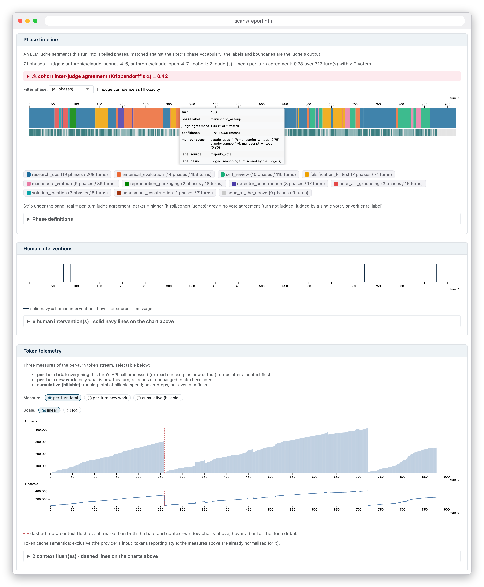
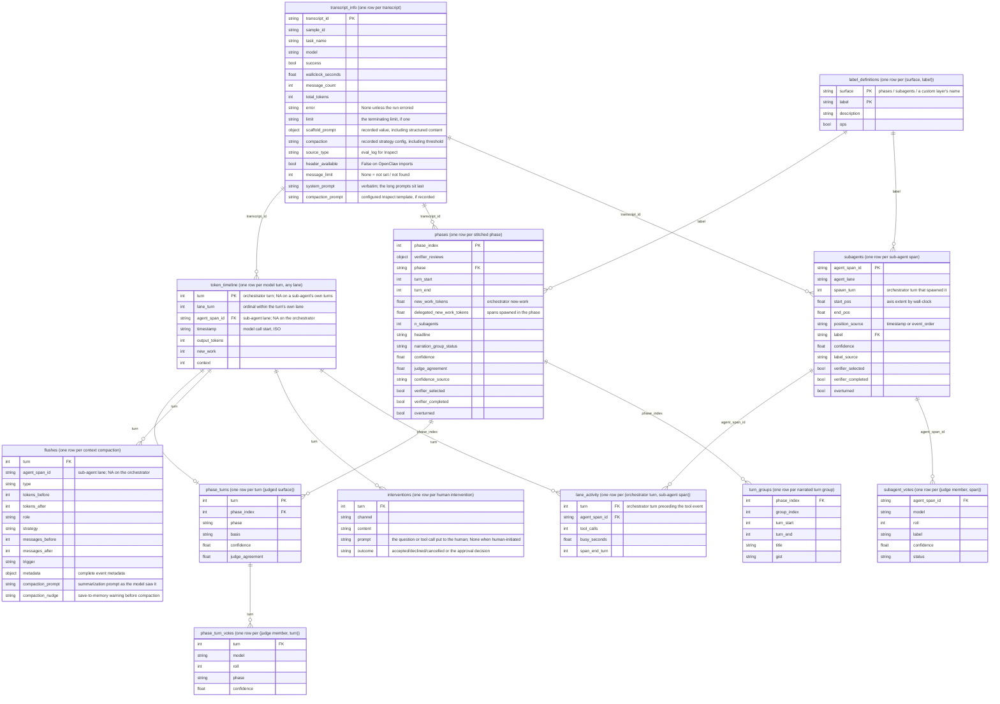

<p align="center">
  <picture>
    <source media="(prefers-color-scheme: dark)" srcset="docs/images/transect-logo-dark.svg">
    
  </picture>
</p>

# Transect

Transcript analysis for long-horizon agent evaluations, built on
[Inspect Scout](https://meridianlabs-ai.github.io/inspect_scout/).

As agent runs stretch to hundreds of pages, the range of what a
reviewer can reliably infer about the model's behaviour narrows.
Pointing an LLM judge at the transcript only moves the problem:
judged labels cannot be taken at face value either. Transect is
built around that fact. Every classification it produces carries
provenance and reliability information so reviewers can inspect how labels
were produced and where judges disagree.

```python
from transect import transect

results = transect(
    "logs/",  # Inspect .eval log(s), or OpenClaw .jsonl
    "spec.yaml",  # your phase + sub-agent vocabulary
    judge_models="anthropic/claude-sonnet-4-6",
)
# Transect report  -> scans/report.html
# Scout viewer  -> http://127.0.0.1:PORT  (deep links into the transcript)
```

Transect places a run on one navigable turn-based timeline:
structural scanners extract recorded events (token use, context
compactions, human interventions, sub-agent activity) at no model
cost, judged scanners classify behaviour against your own
vocabulary, and an HTML report presents both. The
same surfaces land as pandas dataframes, and everything
extends: custom scanners, custom report layers, or a fully custom
UI over the frames.

## Contents

- [Prerequisites](#prerequisites)
- [Installation](#installation)
- [Getting started](#getting-started)
- [Reading the report](#reading-the-report)
- [Working with the dataframes](#working-with-the-dataframes)
- [Custom layers](#custom-layers)
- [Cost](#cost)
- [Development](#development)
- [Acknowledgements](#acknowledgements)
- [Citation](#citation)

## Prerequisites

- Python 3.12+
- The SDK and an API key for each judge-model provider you use:

  ```bash
  pip install anthropic
  export ANTHROPIC_API_KEY=your-anthropic-api-key

  pip install openai
  export OPENAI_API_KEY=your-openai-api-key
  ```

  Any [Inspect AI model
  provider](https://inspect.aisi.org.uk/providers.html) works; a
  judged run without the provider's package installed fails.

- Transcripts: Inspect `.eval` log files, or OpenClaw `.jsonl`
  telemetry exports.

## Installation

Install straight from GitHub:

```bash
uv pip install git+https://github.com/AI-Safety-Institute/transect.git
# or: pip install git+https://github.com/AI-Safety-Institute/transect.git
```

Or clone for a local install (the runnable examples live in the
repository, not the package):

```bash
git clone https://github.com/AI-Safety-Institute/transect
cd transect
uv sync
# or: pip install -e .
```

If you work with a coding agent like Claude Code, the package ships four skills - a
guide to running the default pipeline and reading the report
(`using-transect`), the reliability iteration loop (`transect-diagnostics`),
the custom-layer authoring recipe (`add-a-layer`), and the
custom-presentation recipe (`custom-ui`). Install them into your
project once (re-run after upgrading the package):

```bash
python -m transect.skills install
```

## Getting started

The repository ships a runnable worked example in `examples/`:

Start with a built-in structural run - no judge, no API key, no
model calls:

```bash
uv run python examples/transect_kroll.py --structural
```

It renders `examples/scans/structural/report.html` and opens it with a
Scout viewer wired in; structural data is populated and the Phase
timeline section states that no judge was configured. The following judged
examples require provider credentials and incur model charges:

```bash
uv run python examples/transect_kroll.py    # one judge, 3 rolls + verifier
uv run python examples/transect_cohort.py   # three-model judge cohort
```

`examples/README.md` walks through both.

### Concepts

- **Spec**: one YAML/JSON file describing an evaluation family,
  reusable across its runs: phase vocabulary, sub-agent labels,
  free task context for phase judges.
- **Scanners**: per-transcript extractors, run by Scout. Structural
  scanners are free and always on; judged scanners run when
  `judge_models` is set and the Spec declares their vocabulary.
- **Judge regimes**: one model solo, one model rolled `k_rolls`
  times, or a multi-model cohort - votes decided by majority - plus
  an optional verifier that re-checks doubtful judgements.
- **Frames**: the results as pandas dataframes.
- **Report + viewer**: an HTML report with embedded report data; interactive
  charts load JavaScript assets from a CDN. Full-source links require a running
  local Scout viewer and accessible source transcripts.

### Triaging your own transcripts

Two built-in judged scanners need your input, declared in the
spec. `decision_phases` segments the run into contiguous phases:
it needs the phase vocabulary you expect the run to move through,
each phase described in your own words. `subagent_classification`
labels every spawned sub-agent from its delegation instructions:
it needs the sub-agent roles you expect. Free task context
gives the phase judge background on the eval itself. The better
your descriptions, the better the labelling.

You rarely know the sub-agent roles, and often not the phases,
before looking at a run. Start with a structural run, no judge and
no spend, as in [Getting started](#getting-started): its report
lists every sub-agent span with its full spawn prompt, every human
intervention, and the eval setup. Draft the vocabulary from those,
then run the judges against it. A minimal spec:

```yaml
context: >
  An open-ended AI R&D task: the agent is given a research brief
  and has to implement the described method, run experiments with
  it, and write up its findings. It can delegate subtasks to
  sub-agents.

phases:
  - label: planning
    description: Understanding the brief and choosing an approach.
  - label: implementation
    description: Writing and debugging the method and experiment code.
  - label: experimentation
    description: Running experiments and analysing their results.
  - label: writeup
    description: Writing the findings up into the report.

subagent_labels:
  - label: literature_survey
    description: Surveys prior work relevant to the brief.
  - label: experiment_run
    description: Runs a training or evaluation experiment.
  - label: result_review
    description: Checks results and drafts before they are used.
```

`none_of_the_above` and an operational bucket are always
available to the judges.

> [!TIP]
> The shipped skills help here (see [Installation](#installation)):
> `using-transect` walks this with you: it asks what the eval is,
> runs the structural pass, drafts the spec from both, and confirms
> it with you before any judged run. Expect to iterate, a rubric is
> rarely right first time:
> read the report's reliability audit, refine your labels and
> descriptions, and re-run; `transect-diagnostics` walks that loop.

With the spec written, one call runs the whole pipeline:

```python
from transect import transect

results = transect(
    "logs/my_run.eval",
    "spec.yaml",
    sample="my-sample",  # which sample from the log to scan
    epochs=1,  # which epoch(s); "all" = report per epoch
    judge_models="anthropic/claude-sonnet-4-6",
    k_rolls=3,
    verify=True,
    scans_dir="scans/my_run",  # where the scan results land
)
```

This extracts the structural surfaces, has the judge label every
turn and sub-agent against your spec (three rolls each, majority
vote, with a verifier re-checking doubtful judgements), writes the
results to `scans_dir`, renders the HTML report, and starts the
viewer.

`load(scans_dir)` re-reads a stored scan without rescanning (and without API
calls); `render(results)` re-renders the report. Use `results.scan_location`
to reload that exact scan rather than whichever scan is latest in its parent.

## Reading the report



Top to bottom, everything on the orchestrator's turn axis (sub-agents
appear as swimlanes placed by wall-clock, never as turns of their own):

- **Flags**: a red flag at the very top marks scan execution failures; it
  links to the run-wide "Scan execution & coverage" section at the bottom,
  which also tables the judges' own token usage.
- **Eval setup**: model, scaffold, verbatim prompts (including Inspect's
  compaction prompt and memory nudge), compaction threshold, limits, run summary.
- **Phase timeline**: the phase band plus the per-turn judge-agreement strip.
- **Human interventions**: mid-run operator messages and console inputs.
- **Token telemetry**: per-turn token measures and context size, compactions
  and any recorded compaction threshold marked.
- **Sub-agent activity**: one swimlane box per spawned sub-agent spanning the
  orchestrator turns active while it ran, with its classified role.
- **Token spend**: token quantities by phase, sub-agent, or custom tag family;
  these charts do not estimate monetary cost.
- **Phase cards**: one expandable card per phase: label, narration, excerpts, reliability.
- **Custom layers**: user layers' own sections; `section_order` rearranges the report.
- **Reliability & provenance audit**: per judged surface, how every label was produced.

### Building your own UI

The shipped report is the reference rendering: build your own
presentation over the frames. The reliability and provenance
discipline travels with the data, not with our HTML.

> [!TIP]
> The recipe and checklist are the `custom-ui` skill.

## Working with the dataframes

For custom analysis beyond the generated report, everything the
scanners extracted is exposed as pandas dataframes on the results
object, ready for a notebook or your own Python:

```python
frames = results.frames()  # dict of name -> DataFrame
frames["transcript_info"]  # one row per transcript: task, model, outcome, setup
frames["token_timeline"]  # per-turn token usage + context size
frames["flushes"]  # compaction tokens, role, metadata, Inspect prompt + nudge
frames["interventions"]  # mid-run human interventions
frames["lane_activity"]  # sub-agent tool activity per orchestrator turn
frames["phases"]  # stitched phases + reliability
frames["phase_turns"]  # per-turn phase attribution
frames["turn_groups"]  # narrated turn groups within each phase
frames["phase_turn_votes"]  # per-judge per-turn votes
frames["subagents"]  # one row per sub-agent span, classification when judged
frames["subagent_votes"]  # per-judge votes behind each label
frames["label_definitions"]  # the label rubric the judges classified against
```

Every frame carries the identity prefix (`sample_id`, `task_set`,
`epoch`, `transcript_id`, `agent`) and `schema_version`; per-column
semantics live in the corresponding `transect/frames/*.py` docstring.
They are plain pandas: filter, join, and plot as usual. Frames can contain task
prompts, system/scaffold instructions, human interventions, delegation text and
model-generated explanations. Review dataframes and reports before sharing;
exporting frames is not text removal or anonymization.

### How the frames relate

Each box below is one frame, with its granularity in the header;
the edges are the within-transcript join keys. Boxes list
representative columns; each frame module's docstring is the
complete column contract.



Custom layers sit alongside these: each layer's frame mounts at
`results.layer_frames[name]`, and declared tag families land in
`results.turn_tags`.

### Reliability analysis

`transect.reliability` exposes the functions behind the report's
"Reliability & provenance audit" section for your own analysis
over the frames:

```python
from transect import reliability

reliability.detect_regime(frames["phases"])  # solo / k-roll / cohort + verifier state
reliability.cohort_agreement(frames["phase_turn_votes"], "turn", "phase")
# CohortAgreement(percent_agreement=0.67, alpha=0.57, ac1=0.65, n=1424)
reliability.relabel_rate(frames["phases"])  # verifier re-labels, overall + per label
reliability.spot_check_overturns(frames["phases"])  # overturns among random spot-checks
reliability.member_coverage(
    frames["phase_turn_votes"],
    "basis",
    "judged",
    ("refusal", "no_answer", "missing_turn", "filled"),
)  # usable judgements per (model, roll), with miss reasons
reliability.label_stats(
    frames["phase_turns"][frames["phase_turns"].basis == "judged"],  # decided units
    frames["phase_turn_votes"],  # the member ballots behind them
    frames["phases"],  # the verifier review records
    "turn",  # unit column
    "phase",  # label column
)  # per-label confidence / agreement / provenance breakdown
```

> [!IMPORTANT]
> These are reliability measures (repeatability, agreement,
> coverage), never correctness: high agreement can be judges
> sharing a bias.

Custom scanners built on `transect.cohort_llm_scanner` can use
these reliability functions out of the box.

## Custom layers

`extra_layers` injects your own additions into a run. The runnable
worked example is `examples/transect_custom_layer.py`; the shape:

```python
from inspect_scout import scanner
from transect import Layer, cohort_llm_scanner, reasoning_turns, transect, turns_frame
from transect.report import Markdown, TurnBand

@scanner(loader=reasoning_turns())  # the units to judge: one item per reasoning turn
def research_skills(spec, judge_models=None):
    skills = spec.extra["research_skills"]  # the rubric lives in the spec
    question = "Label this reasoning turn with the best-fitting category:\n" + "\n".join(
        f"- {label}: {text}" for label, text in skills.items()
    )
    return cohort_llm_scanner(
        question=question,  # the closed-vocab judge prompt
        answer=list(skills),
        models=judge_models,
        vocabulary=skills,  # recorded as the layer's rubric
    )


results = transect(
    logs,
    spec,
    judge_models=...,
    extra_layers=[
        Layer(
            name="research_skills",
            # a judged classification over your own vocabulary
            scanner=research_skills,
            # its dataframe, mounted at results.layer_frames[name]
            frame=turns_frame,
            # phase-card chips + a token-spend grouping
            # (tag family -> frame column)
            tags={"skill": "label"},
            # an entity block in the reliability audit
            # ((unit column, label column))
            audit=("turn", "label"),
            # the layer's own report section
            section=[
                Markdown("#### One skill label per reasoning turn"),
                TurnBand(label="label"),
            ],
        )
    ],
)
results.layer_frames["research_skills"]  # the layer's own frame
results.turn_tags  # tag families, per turn
```

Each `Layer` field is one surface, all optional:

- **scanner** - `cohort_llm_scanner` inherits the judge regimes,
  voting, verifier, and batching; structural scanners are $0. Pass
  the factory un-invoked: `transect()` calls it with the judge
  arguments its signature declares, the loaded `spec` when declared,
  and any `scanner_args={...}` on the layer.
- **frame** - post-processes the scan results into the layer's
  dataframe (`turns_frame`: one judged row per turn), or injects a
  ready dataframe with your own data.
- **section / tags / audit** - typed report blocks, phase-card
  chips plus the spend grouping, and an audit entity block.

> [!TIP]
> The full authoring recipe is the shipped `add-a-layer` skill.

## Cost

Structural extraction is free (no LLM calls): without
`judge_models`, or without the matching Spec vocabulary, only the
structural scanners run and the whole scan costs nothing. Custom
scanners can make their own provider calls regardless of those
switches. Judged surfaces cost roughly (turns + sub-agents) x judges
x rolls calls per transcript; the demo example costs cents.

Batching is the cost lever on long runs: `reasoning_turns(batch=N)`
with `cohort_llm_scanner(batch=True)` judges N units per call,
cutting a layer's classification calls. Each batched call returns
one answer per unit, so votes are still counted per unit and the
verifier still reviews individual units.

Two caches sit at different levels, and neither is the provider's.
The scan store (`scans_dir`) holds a finished scan's results:
`load()` rebuilds the frames and the report from it without any
model calls (each OpenClaw import also parses a new transcript
snapshot there, so repeated imports use disk). Beneath it,
inspect-ai keeps a machine-global response cache, shared across
projects and venvs - a fresh output directory or virtual environment
is not a fresh model call: a new `transect()` call always re-runs
the scan, but any judge call identical to a cached one replays from
disk, so repeating an unchanged analysis costs almost nothing.
Provider-side prompt caching is separate again and is charged by the
provider. For a stability study or a genuinely cold run, bypass or
clear the response cache:

```bash
INSPECT_CACHE_DIR=$(mktemp -d) python my_analysis.py  # bypass, one run
inspect cache clear                                   # or wipe it
```

## Development

```bash
uv sync        # install the package + dev dependencies
make lint      # ruff check + format check
make typecheck # mypy + pyright
make test      # pytest
make check     # all of the above
```

Tests are plain pytest under `tests/`. One test loads the rendered
report in a real browser to catch chart errors; it needs the
optional `ui-test` dependency group (not installed by default) and
skips without it:

```bash
uv run --group ui-test playwright install chromium  # one-time
uv run --group ui-test pytest
```

If you work on this repo with a coding agent like Claude Code,
see [AGENTS.md](AGENTS.md). For work against the wider Inspect
ecosystem's APIs, the
[Meridian inspect-skills plugin](https://github.com/meridianlabs-ai/inspect-skills)
keeps a coding agent on current API docs. Install it once with
`/plugin marketplace add meridianlabs-ai/inspect-skills` then
`/plugin install inspect-skills@meridian`.

## Acknowledgements

Transect is developed in collaboration by the
[UK AI Security Institute](https://www.aisi.gov.uk/) and
[Meridian Labs](https://meridianlabs.ai/).

Built on the Inspect ecosystem: [Inspect
AI](https://inspect.aisi.org.uk/) (eval framework and logs),
[Inspect Scout](https://meridianlabs-ai.github.io/inspect_scout/)
(transcript scanning), and
[Inspect Viz](https://meridianlabs-ai.github.io/inspect_viz/)
(report charts).

## Citation

A paper describing the method is forthcoming.
