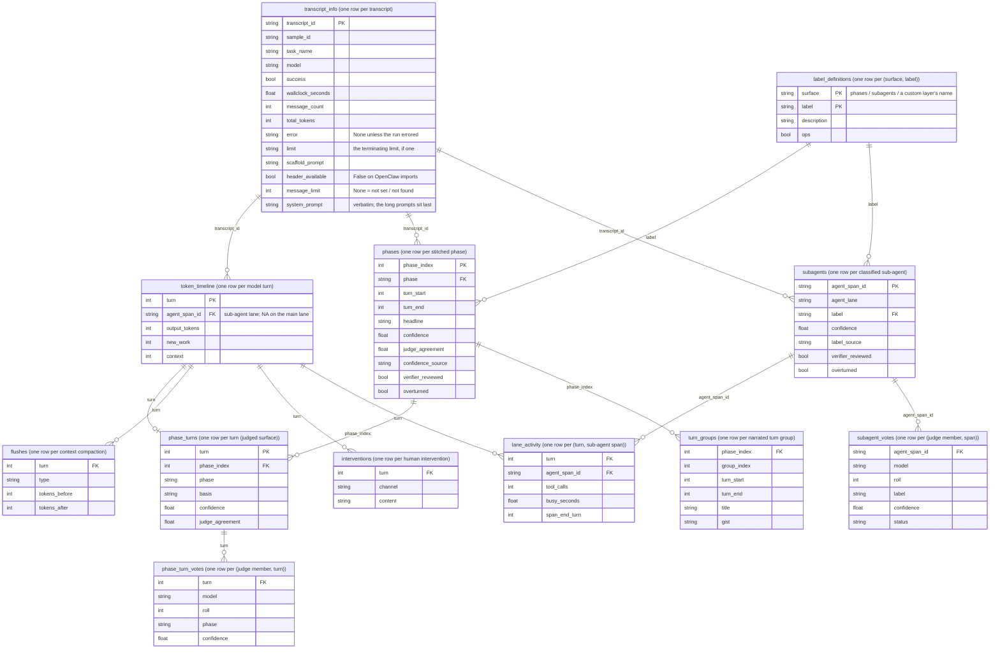

# Transect

Transcript analysis for long-horizon agent evaluations, built on
[Inspect Scout](https://meridianlabs-ai.github.io/inspect_scout/).

Transect scans an agent run and produces a single interactive HTML
report of what happened: how the run divides into phases of work,
what every spawned sub-agent was asked to do, where the context
window was compacted, where a human intervened, and where the
tokens went. The same surfaces land as typed pandas dataframes
for your own analysis.

```python
from transect import transect

results = transect(
    "logs/",  # Inspect .eval log(s), or OpenClaw .jsonl
    "spec.yaml",  # your phase + sub-agent vocabulary
    judge_models="anthropic/claude-sonnet-4-6",
)
# Transect report  -> scans/report.html
# Scout viewer  -> http://127.0.0.1:PORT  (deep links into the transcript)
```

## What is it for

Reviewing a multi-hour agent transcript by reading it end to end
does not scale: thousands of turns, sub-agents running in
parallel. Transect is the pre-read. It gives a reviewer a map of the
run so their attention goes to the parts worth reading closely,
with deep links into the full transcript.

**Mechanical extraction** (read directly off the log, no LLM
calls):

- per-turn token usage (input, output, cache reads/writes,
  reasoning) and the context-window size;
- context compactions: where the context was summarised or
  trimmed, and the token count before and after;
- human interventions: operator messages and console inputs
  mid-run, with their turn and content;
- sub-agent lanes: every spawned sub-agent's span, its spawn
  task, and its per-turn tool activity.

**Enrichment via LLM judge(s)** (when `judge_models` is set):

- phases: the run segmented against your phase vocabulary, each
  phase with a turn range and a narration;
- sub-agent roles: each spawned sub-agent classified against your
  sub-agent labels.

Every judgement carries reliability metadata: the judges' stated
confidence, agreement across votes, and any verifier review. This
is core to how Transect is meant to be used: read the reliability
alongside the labels, and iterate on your spec and judge setup
until it is acceptable.

## Concepts

Five terms carry the whole package:

- **Spec**: your description of the eval, one YAML/JSON file: a
  phase vocabulary (label + description per phase), sub-agent
  labels, and free task context for the judges. See
  `examples/spec.yaml` for a worked one.
- **Scanners**: per-transcript extractors, run by Scout. The
  mechanical scanners are free and always on (token timeline,
  context flushes, human interventions, sub-agent lanes); the
  judge scanners run when `judge_models` is set (phase
  segmentation + narration, sub-agent classification).
- **Judge regimes**: one model judging solo; one model rolled
  `k_rolls` times with a majority vote; several models as a
  cohort with a majority vote; plus an optional second-round
  verifier that re-checks doubtful judgements (low confidence or
  low agreement) and can overturn them.
- **Frames**: the results as pandas dataframes, one per extracted
  or judged output (phases, sub-agent roles, token timeline, ...).
  Each frame module's docstring is its column contract.
- **Report + viewer**: a self-contained HTML report rendered from
  the frames, and a local Scout viewer for the underlying
  transcripts; report elements deep-link into the viewer.

## Prerequisites

- Python 3.12+
- The SDK and an API key for each judge-model provider you use:

  ```bash
  pip install anthropic
  export ANTHROPIC_API_KEY=your-anthropic-api-key

  pip install openai
  export OPENAI_API_KEY=your-openai-api-key
  ```

  Any [Inspect AI model
  provider](https://inspect.aisi.org.uk/providers.html) works; a
  judged run without the provider's package installed fails.

- Transcripts: Inspect `.eval` log files, or OpenClaw `.jsonl`
  telemetry exports.

## Installation

Install straight from GitHub:

```bash
uv pip install git+https://github.com/AI-Safety-Institute/transect.git
# or: pip install git+https://github.com/AI-Safety-Institute/transect.git
```

Or clone for a local install (the runnable examples live in the
repository, not the package):

```bash
git clone https://github.com/AI-Safety-Institute/transect
cd transect
uv sync
# or: pip install -e .
```

If you work with Claude Code, the package ships four skills - a
guide to running the default pipeline and reading the report
(`using-transect`), the reliability iteration loop (`transect-diagnostics`),
the custom-layer authoring recipe (`add-a-layer`), and the
custom-presentation recipe (`custom-ui`). Install them into your
project once (re-run after upgrading the package):

```bash
python -m transect.skills install   # copies them into ./.claude/skills/
```

## Getting started

The repository ships a runnable worked example in `examples/`:

```bash
python examples/transect_kroll.py    # one judge, 3 rolls + verifier
python examples/transect_cohort.py   # three-model judge cohort
```

`examples/README.md` walks through both, the spec, and a $0 dry
run (`judge_models=None`: mechanical extraction only, no API
calls).

### Triaging your own transcripts

The core of Transect is helping you understand a long run by
segmenting it into smaller phases, directing your attention to
the turns that are load-bearing. We expect you to be somewhat
familiar with the eval you want to analyse: the better the
information you can provide about what you already know and what
you expect to happen, the better the segmentation and labelling
will be.

Your knowledge of the eval goes into the spec. It declares the
phases you expect the run to move through and the sub-agent roles
you expect it to spawn, each with a description in your own words,
plus free task context; the LLM judges hold this vocabulary
against the transcript. A minimal spec:

```yaml
context: >
  An open-ended AI R&D task: the agent is given a research brief
  and has to implement the described method, run experiments with
  it, and write up its findings. It can delegate subtasks to
  sub-agents.

phases:
  - label: planning
    description: >
      Understanding the brief and choosing an approach: reading,
      framing the problem, designing the experiments.
  - label: implementation
    description: >
      Writing and debugging the code for the method and the
      experiment pipeline.
  - label: experimentation
    description: >
      Running experiments and analysing their results.
  - label: writeup
    description: >
      Writing the findings up into the report.

subagent_labels:
  - label: literature_survey
    description: Surveys prior work relevant to the brief.
  - label: experiment_run
    description: Runs a training or evaluation experiment.
  - label: result_review
    description: Checks results and drafts before they are used.
```

`none_of_the_above` and an operational bucket are always
available to the judges.

With the spec written, one call runs the whole pipeline:

```python
from transect import transect

results = transect(
    "logs/my_run.eval",
    "spec.yaml",
    sample="my-sample",  # which sample from the log to scan
    epochs=1,  # which epoch(s); "all" = report per epoch
    judge_models="anthropic/claude-sonnet-4-6",
    k_rolls=3,
    verify=True,
)
```

This extracts the mechanical surfaces, has the judge label every
turn and sub-agent against your spec (three rolls each, majority
vote, with a verifier re-checking doubtful judgements), writes the
results to `scans_dir` as dataframes, renders the HTML report, and
starts the viewer.

`load(scans_dir)` re-reads a finished scan without rescanning (and
without API calls); `render(results)` re-renders the report.

## Reading the report


Top to bottom, everything on a shared turn axis:

- **Eval setup**: core setup (model, scaffold and its arguments,
  the verbatim initial prompts), additional config details (limits,
  dataset, scorers, generation config; "data not found" where the
  source never recorded a fact), and a run summary (messages, wall
  clock, tokens, outcome).
- **Phase timeline**: the run segmented into your phase
  vocabulary, one colored band per phase; the agreement strip
  below it shows per-turn judge agreement, grey where a turn was
  not judged, had a single voter, or was re-labelled by the
  verifier.
- **Human interventions**: mid-run operator messages and console
  inputs on their own chart, directly below the timeline; hover
  for source and message.
- **Token telemetry**: three selectable measures of the per-turn
  token stream (per-turn total, per-turn new work, cumulative
  billable) plus the context-window size, with context
  compactions marked on the charts.
- **Sub-agent activity**: one swimlane per spawned sub-agent with
  its classified role, its activity span, and where it joined
  back into the main lane.
- **Token spend**: where the tokens went, broken down by phase
  label, by sub-agent, and - when custom layers declare tag
  families - by any tag family, behind a grouping selector.
- **Phase cards**: one card per phase: label, narration, turn
  range, token spend, the sub-agents active in it, and reliability
  annotations (vote agreement, verifier overturns).
- **Custom layers**: any user layers' badge-marked sections render
  after the built-ins (see "Custom layers" below); `section_order`
  rearranges the whole report.
- **Reliability & provenance audit**: per judged surface (phases,
  sub-agents, plus each audit-declaring custom layer), the
  run-level reliability accounting - turn coverage
  (judged / filled / unjudged), judge regime, vote agreement and
  confidence tiers, verifier selection and outcomes, abstentions -
  plus per-classification heatmaps: a reliability map (agreement,
  confidence, verifier re-label and spot-check rates, minority-vote
  share per label, with confidence intervals), member coverage per
  judge, and a provenance map of who decided each label.

## Working with the dataframes

For custom analysis beyond the generated report, everything the
scanners extracted is exposed as pandas dataframes on the results
object, ready for a notebook or your own Python:

```python
frames = results.frames()  # dict of name -> DataFrame
frames["transcript_info"]  # one row per transcript: task, model, outcome,
# prompts, scaffold + eval config
frames["token_timeline"]  # per-turn token usage + context size
frames["flushes"]  # context compactions, tokens before/after
frames["interventions"]  # mid-run human interventions
frames["lane_activity"]  # per-turn sub-agent tool activity
frames["phases"]  # stitched phases + reliability
frames["phase_turns"]  # per-turn phase attribution
frames["phase_turn_votes"]  # per-judge per-turn votes
frames["turn_groups"]  # narrated turn groups within each phase
frames["subagents"]  # one row per classified sub-agent
frames["subagent_votes"]  # per-judge votes behind each label
frames["label_definitions"]  # the label rubric the judges classified against
```

Every frame carries the identity prefix (`sample_id`, `task_set`,
`epoch`, `transcript_id`, `agent`) and `schema_version`; per-column
semantics live in the corresponding `transect/frames/*.py` docstring.
They are plain pandas: filter, join, and plot as usual.

The reliability statistics behind the report's audit are public too -
`transect.reliability` exposes the same pure functions (Krippendorff's
alpha, Gwet's AC1, Wilson intervals, verifier re-label rates,
per-classification and per-member stats) for your own analysis over
the frames:

```python
from transect.reliability import cohort_agreement

cohort_agreement(frames["phase_turn_votes"], "turn", "phase")
# CohortAgreement(percent_agreement=0.67, alpha=0.57, ac1=0.65, n=1424)
```

These are reliability measures (repeatability, agreement, coverage),
never correctness measures, high agreement can be judges sharing a bias.

The functions run over any frame with the right columns, so they work
on custom judged layers too: build the layer's scanner on
`transect.cohort_llm_scanner` and have its frame project
`transect.judge_identity` (plus `judge_models` / `verifier_model`) and the
verifier review columns. Each function checks its columns upfront and
raises a `KeyError` naming the missing ones and how to project them;
the full requirements live in each function's docstring. In short:

| function | built-in frame(s) to pass | required columns |
|---|---|---|
| `detect_regime(frame)` | phases / subagents | `judge_regime`, `n_models`, `k_rolls`, `verifier_armed`, `verifier_same_model`, `judge_models`, `verifier_model` |
| `cohort_agreement(votes, unit_col, label_col)` | phase_turn_votes / subagent_votes | `unit_col`, `label_col` (long-format ballots) |
| `label_stats(decided, votes, frame, ...)` | decided: phase_turns (`basis == "judged"`) / subagents (`label` set); votes: phase_turn_votes / subagent_votes; frame: phases / subagents | decided: `unit_col`, `label_col`, `judge_agreement`, `confidence`, `label_source`; votes: `unit_col`, `label_col`; frame: `original_label`, `verifier_reviewed`, `overturned`, `verifier_trigger` |
| `relabel_rate(frame, label_col)` | phases / subagents | `verifier_reviewed`, `overturned`, `label_col` |
| `spot_check_overturns(frame)` | phases / subagents | `overturned`, `verifier_trigger` |
| `member_coverage(votes, ok_col, ...)` | phase_turn_votes / subagent_votes | `model`, `roll`, `ok_col` |

Units are keyed per transcript whenever the frame carries
`transcript_id`, so multi-transcript frames never pool across runs.

### How the frames relate

Each box below is one frame, with its granularity in the header;
the edges are the within-transcript join keys.



Custom layers sit alongside these: each layer's frame mounts at
`results.layer_frames[name]` (its columns are the layer's own), and
declared tag families land in `results.turn_tags`, one wide row per
(transcript, turn).

### Building your own UI

The shipped report is the reference rendering, not the ceiling.
When its layout or scope is not enough - a paper figure, a
deliverable in someone else's template, a cross-run dashboard -
build your own presentation over the frames. The one rule: the
reliability and provenance discipline travels with the data, not
with our HTML. A custom rendering keeps provenance beside every
judged label, states its denominators, shows unjudged mass
honestly, embeds a compact reliability annex when it stands alone,
and references Transect as the source of the analysis. The full recipe
and checklist are the `custom-ui` skill.

## Custom layers

`extra_layers` injects your own additions into a run: a judged
classification over your own vocabulary, extra report sections,
phase-card tags, a token-spend grouping, and an entity block in the
reliability audit. The runnable worked example is
`examples/transect_custom_layer.py`; the shape:

```python
from inspect_scout import scanner
from transect import Layer, cohort_llm_scanner, reasoning_turns, transect, turns_frame
from transect.report import Markdown, TurnBand

SKILLS = {
    "hypothesis": "Proposing a new idea, mechanism, or approach to test.",
    # ...
    "none_of_the_above": "No research-skill reasoning in this turn.",
}


@scanner(loader=reasoning_turns())
def research_skills(judge_models=None):
    return cohort_llm_scanner(
        question=QUESTION,  # the closed-vocab judge prompt
        answer=list(SKILLS),
        models=judge_models,
        vocabulary=SKILLS,  # recorded as the layer's rubric
    )


results = transect(
    logs,
    spec,
    judge_models=...,
    extra_layers=[
        Layer(
            name="research_skills",
            scanner=research_skills,  # factory: judge roster from transect()
            frame=turns_frame,  # results -> one judged row per turn
            tags={"skill": "label"},  # card chips + spend grouping
            audit=("turn", "label"),  # audit entity block
            section=[
                Markdown("#### One skill label per reasoning turn"),
                TurnBand(label="label"),
            ],
        )
    ],
)
results.layer_frames["research_skills"]  # the layer's own frame
results.turn_tags  # tag families, per turn
```

Each `Layer` field is one surface, all optional:

- **scanner** - the judged path: `transect.cohort_llm_scanner` behind
  your own `@scanner` factory gives the same solo / k-roll / cohort
  regimes, majority vote, and verifier as the built-in scanners,
  with the judge-identity provenance stamped automatically. The
  loader picks the unit of judgement (per turn, any custom unit, or
  none - the whole transcript as one item), and can batch:
  `reasoning_turns(batch=N)` with `cohort_llm_scanner(batch=True)`
  judges up to N units per call - the cost lever on long runs -
  while votes, verifier reviews, and the results stay per unit.
  Always include a `none_of_the_above` escape hatch in the
  vocabulary. A judge is not required: a mechanical scanner (a grep
  or metric over turns) or a ready DataFrame with no scanner at all
  are both $0 layers.
- **frame** - the layer's pandas mount at
  `results.layer_frames[name]`; `load(scans_dir, extra_layers=...)`
  remounts it from a stored scan, and the `transect.reliability`
  functions run over it directly.
- **section / tags / audit** - typed report blocks on the shared
  turn axis (never raw HTML), phase-card chips plus the token-spend
  grouping, and an entity block in the closing reliability audit;
  `section_order` places the layer's section anywhere in the report.

The full authoring recipe is the shipped `add-a-layer` skill.

## Cost

Mechanical extraction is free (no LLM calls). Judged surfaces cost
roughly (turns + sub-agents) x judges x rolls calls per transcript;
the demo example costs cents. Scout caches scanner results in the
scan store, so re-running an identical scan replays from disk and
`load()` never calls an API.

Judge responses are also cached by inspect-ai on disk, and that
cache is machine-global (shared across projects and venvs, under
`XDG_CACHE_HOME`). For a stability study or a genuinely cold run, pass `cache=False`.

## Development

```bash
uv sync        # install the package + dev dependencies
make lint      # ruff check + format check
make typecheck # mypy + pyright
make test      # pytest
make check     # all of the above
```

Tests are plain pytest under `tests/`. One test loads the rendered
report in a real browser to catch chart errors; it needs the
optional `ui-test` dependency group (not installed by default) and
skips without it:

```bash
uv run --group ui-test playwright install chromium  # one-time
uv run --group ui-test pytest
```

If you work on this repo with Claude Code (or another coding agent),
see [AGENTS.md](AGENTS.md). For work against the wider Inspect
ecosystem's APIs, the
[Meridian inspect-skills plugin](https://github.com/meridianlabs-ai/inspect-skills)
keeps a coding agent on current API docs - install it once with
`/plugin marketplace add meridianlabs-ai/inspect-skills` then
`/plugin install inspect-skills@meridian`.

## Acknowledgements

Built on the Inspect ecosystem: [Inspect
AI](https://inspect.aisi.org.uk/) (eval framework and logs),
[Inspect Scout](https://meridianlabs-ai.github.io/inspect_scout/)
(transcript scanning), and
[Inspect Viz](https://meridianlabs-ai.github.io/inspect_viz/)
(report charts).

## Citation

A paper describing the method is forthcoming.
